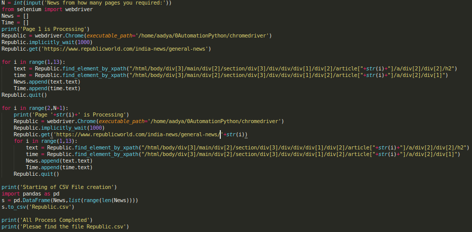
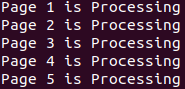
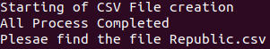
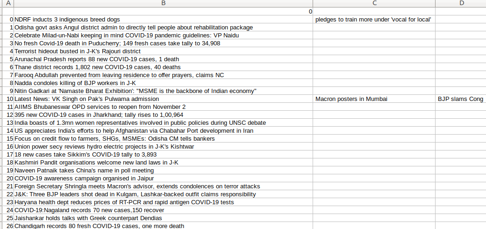

# WebScrapping to get GeneralNews from First N Pages of RepublicMediaNetwork Website
This repository help you to get General News from first N pages of RepublicMediaNetwork Official Website.
## Step 1:
Download newsFromRepublicTV.py from this repository

## Step 2:
Execute the file

## Step 3:
Enter the number of pages you required to get the news

## Step 4:
You will get a file (Republic.csv) which consists of N*12 News article heading

## Output CSV File looks like the following picture

